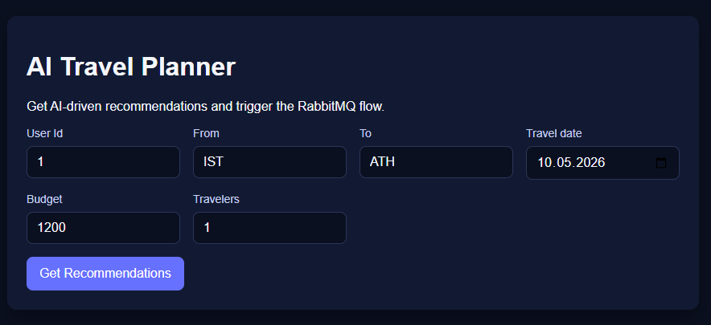
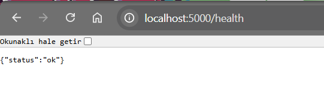
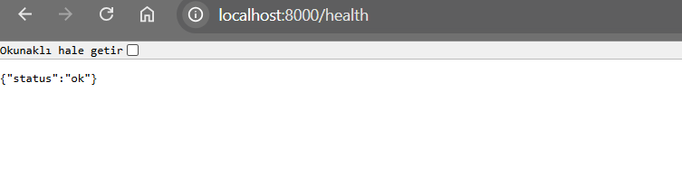
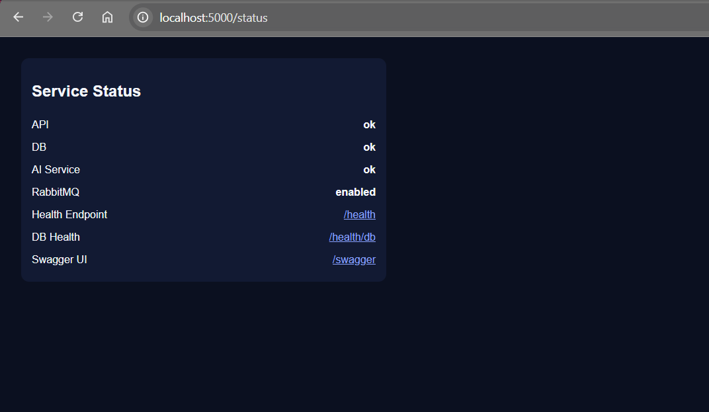

# 🌍 AITravelPlanner.API

**AITravelPlanner.API** is a backend service for an AI-based travel planner application. It provides flight search, booking, recommendation services, and integration with AI models to optimize user experience.

---

## 📌 Features
✅ Flight Search and Booking (via BiletBank API)  
✅ AI-based Travel Recommendations (via FastAPI)  
✅ User Authentication & Authorization (JWT)  
✅ Database Management (EF Core + SQL Server / PostgreSQL)  
✅ RESTful API with OpenAPI Documentation (Swagger)  
✅ CI/CD with GitHub Actions  
✅ Unit Testing (xUnit, Moq)  
✅ RabbitMQ for Asynchronous Processing  

---

## 🚀 Tech Stack
- **Backend:** .NET 8 (ASP.NET Core Web API)
- **AI Service:** Python (FastAPI)
- **Database:** PostgreSQL / SQL Server
- **ORM:** Entity Framework Core
- **Authentication:** JWT
- **Logging:** Serilog
- **Messaging Queue:** RabbitMQ (Optional)
- **Containerization:** Docker
- **CI/CD:** GitHub Actions

---

## 📂 Project Structure
```bash
AITravelPlanner/
 ├── AITravelPlanner.API/         # .NET Core Web API (Backend)
 ├── AITravelPlanner.AIService/   # Python FastAPI AI recommendation service
 ├── AITravelPlanner.Common/      # Shared models and helper functions
 ├── AITravelPlanner.Data/        # Database access layer
 ├── AITravelPlanner.Domain/      # Entity and DTO models
 ├── AITravelPlanner.Services/    # Business logic service layer
 ├── AITravelPlanner.Tests/       # Unit tests
 ├── AITravelPlanner.Frontend/    # React or Next.js (Optional)
```


## 🧪 Local Development
### Backend API (.NET)
```bash
dotnet restore
dotnet run --project AITravelPlanner.API
```

Health and status:
- http://localhost:5000/health
- http://localhost:5000/health/db
- http://localhost:5000/status

### AI Service (FastAPI)
```bash
cd AITravelPlanner.AIService
python -m venv .venv
source .venv/bin/activate  # Windows: .venv\Scripts\activate
pip install -r requirements.txt
uvicorn main:app --reload --port 8000
```

### Frontend (Next.js)
```bash
cd AITravelPlanner.Frontend
npm install
npm run dev
```
Environment:
- Copy `AITravelPlanner.Frontend/.env.example` to `.env.local` for local runs.

## 🐳 Docker Compose
```bash
docker compose up --build
```

Services:
- API: http://localhost:5000
- AI Service: http://localhost:8000/health
- Frontend: http://localhost:3000
- RabbitMQ UI: http://localhost:15672 (guest/guest)

Docker env file:
- `.env.docker` contains SQL Server password and connection string.

Seed verification:
- After first run, `GET /api/Travel/user/1` returns seeded travel data.

Docker volume persistence:
- Stop containers and run `docker compose up` again; seeded data remains in SQL Server volume.

## 📸 Screenshots





## 👨‍💻 Contributors
- **[Yaprak Yıldırım](https://github.com/yaprakyildirim)** - Maintainer

---

## ⭐ Support & Feedback
If you find this project useful, consider giving it a ⭐ on GitHub!

For issues & suggestions, open a new issue in the [GitHub Repository](https://github.com/yaprakyildirim/AITravelPlanner.API/issues).
